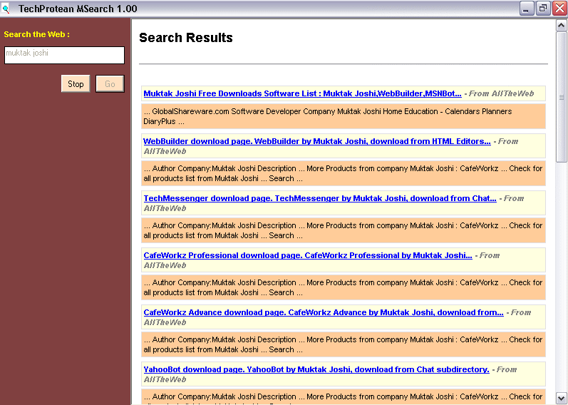



## A 6 Search Engine Parsing Tool

### Description

Search in 6 Different Engines, Parse the Results and display sorted output according to hits in earch engine.Does not redirect you to each search engine like other search tools available at PSC. It actually parses the results and shows it in its own window.
 
### More Info
 

             |
---                |---
**Submitted On**   |2003-03-23 17:46:30
**By**             |[Muktak Joshi](https://github.com/Planet-Source-Code/PSCIndex/blob/master/ByAuthor/muktak-joshi.md)
**Level**          |Intermediate
**User Rating**    |5.0 (30 globes from 6 users)
**Compatibility**  |VB 6\.0
**Category**       |[Internet/ HTML](https://github.com/Planet-Source-Code/PSCIndex/blob/master/ByCategory/internet-html__1-34.md)
**World**          |[Visual Basic](https://github.com/Planet-Source-Code/PSCIndex/blob/master/ByWorld/visual-basic.md)
**Archive File**   |[TechSearch1580364282003\.zip](https://github.com/Planet-Source-Code/muktak-joshi-a-6-search-engine-parsing-tool__1-45091/archive/master.zip)

